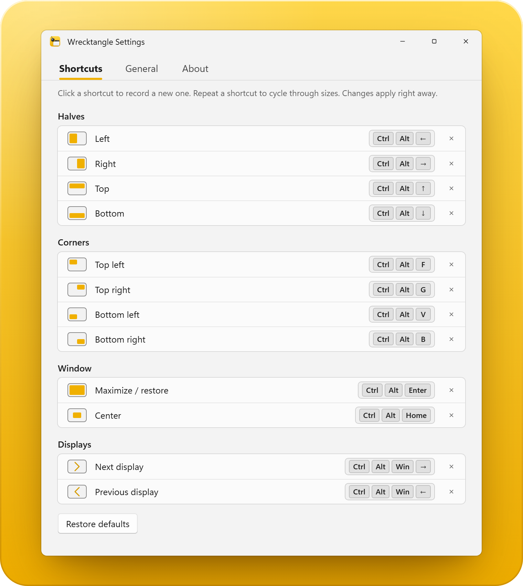

<p align="center">
  
</p>

<h1 align="center">Wrecktangle</h1>

<h3 align="center">Snap windows from the keyboard.</h3>

<p align="center">
  A <a href="https://rectangleapp.com">Rectangle</a>-style window manager for Windows, written in Rust.<br>
  Send the focused window to a half, a corner or the center with one shortcut, and press it again to change its size.
</p>

<p align="center">
  <a href="https://github.com/zolferfigueiredo/wrecktangle/releases/latest"></a>
  <a href="https://www.rust-lang.org"></a>
  
  <a href="https://github.com/zolferfigueiredo/wrecktangle/actions/workflows/ci.yml"></a>
</p>

<p align="center">
  <a href="https://github.com/zolferfigueiredo/wrecktangle/releases/download/v0.3.1/Wrecktangle-0.3.1-x64-setup.exe"><b>Download for Windows</b></a>
  &nbsp;·&nbsp;
  <a href="https://github.com/zolferfigueiredo/wrecktangle/releases/download/v0.3.1/Wrecktangle-0.3.1-x64.zip">Portable zip</a>
</p>

<p align="center">
  
</p>

## Install

1. [Download the installer](https://github.com/zolferfigueiredo/wrecktangle/releases/download/v0.3.1/Wrecktangle-0.3.1-x64-setup.exe)
   and run it. It installs for your user only, into
   `%LOCALAPPDATA%\Programs\Wrecktangle`, and never asks for admin rights. It
   isn't code signed yet, so if Windows SmartScreen says it protected your PC,
   click **More info**, then **Run anyway**.
2. Tick **Launch at startup** to have Wrecktangle start every time you sign in.
   It runs from the tray.
3. Press Ctrl+Alt+Left. The focused window fills the left half of its screen.
   Press it again for two thirds, and again for three quarters.

Or take the [portable zip](https://github.com/zolferfigueiredo/wrecktangle/releases/download/v0.3.1/Wrecktangle-0.3.1-x64.zip):
put `wrecktangle.exe` somewhere permanent, run it from there, and turn on
**Launch at startup** from the tray menu.

You need Windows 10 or 11, 64-bit. Uninstall it from Apps in Windows Settings.

**Coming from Wectangle?** Wrecktangle used to be called Wectangle. On its
first start it closes a running Wectangle, copies
`%APPDATA%\Wectangle\config.json` to `%APPDATA%\Wrecktangle\config.json`, and
moves the "Launch at startup" entry to the new exe. The old `wectangle.exe` and
`%APPDATA%\Wectangle` can be deleted afterwards.

## Features

- **One shortcut per spot.** The left, right, top and bottom halves, the four
  corners, the center, and maximize or restore. No dragging, no snap zones.
- **Press again to resize.** Repeating a shortcut steps through a size cycle:
  1/2, 2/3 and 3/4 of the screen by default, or any mix of 1/4, 1/3, 1/2, 2/3
  and 3/4.
- **Every monitor.** Move a window to the next or previous display with a
  shortcut.
- **Lines up exactly.** Sizes use the window's visible frame, so snapped windows
  meet edge to edge without the gap Windows' invisible resize border leaves.
- **Takes over busy shortcuts.** When Windows or another app already owns a
  chord, such as Alt+Win+Left, Wrecktangle takes it over instead of giving up,
  and Settings names the app it overrides, for example "Overrides PowerToys
  Peek".
- **A Windows 11 style Settings window.** Fluent design, following the light or
  dark theme, in the Windows blue or Wrecktangle's own yellow. Change any
  shortcut, the size cycle or launch at startup, and every change applies as
  you make it.
- **Speaks 12 languages.** Deutsch, English, Español, Français, Italiano,
  Polski, Português, Русский, Українська, 中文, 日本語 and 한국어. The first run
  follows the Windows display language, and **Language** in Settings switches
  Settings, the tray menu and notifications at once.
- **Tells you about updates.** It checks GitHub once a day or on demand, and a
  notification links to the new installer. It never installs anything by
  itself.
- **No admin rights.** Unless the window you want to move runs as administrator
  (see [Limitations](#limitations)).
- **Lives in the tray.** Opening it again while it runs brings up Settings
  instead of a second copy.

## Default shortcuts

| Action | Default |
| --- | --- |
| Left (full height) | Ctrl+Alt+Left |
| Right (full height) | Ctrl+Alt+Right |
| Top (full width) | Ctrl+Alt+Up |
| Bottom (full width) | Ctrl+Alt+Down |
| Top-left | Ctrl+Alt+F |
| Top-right | Ctrl+Alt+G |
| Bottom-left | Ctrl+Alt+V |
| Bottom-right | Ctrl+Alt+B |
| Maximize / restore | Ctrl+Alt+Enter |
| Center | Ctrl+Alt+Home |
| Next display | Ctrl+Alt+Win+Right |
| Previous display | Ctrl+Alt+Win+Left |

Every shortcut can be changed in Settings, from the tray icon.

## How it works

<details>
<summary><b>Shortcut takeover</b></summary>

Wrecktangle first asks Windows to register each shortcut. When another app, or
Windows itself, already owns one, Wrecktangle takes it over with one global
low-level keyboard hook, installed only while at least one shortcut needs it.
While the hook is on, the taken-over chord triggers Wrecktangle's action and is
hidden from the owner and from the focused app. Settings shows the status as
"Overrides <app>".

- Win+L and Ctrl+Alt+Del are handled by Windows below the hook, so they
  cannot be taken over. Settings shows "Reserved by Windows" for them.
- The owner name comes from the other app's own hotkey settings (PowerToys,
  Twinkle Tray, the NVIDIA overlay, the Claude desktop Quick Entry shortcut),
  from a table of built-in Windows chords, and, marked "probably", from
  Windows Magnifier and the default Claude shortcut while those apps run.
  Only hotkey fields are read; tokens and other settings in those files are
  ignored.
- The hook runs on Wrecktangle's UI thread. If that thread stalls, Windows can
  stop calling the hook, and taken-over shortcuts stop working until
  Wrecktangle restarts.

</details>

<details>
<summary><b>Updates</b></summary>

Wrecktangle asks `api.github.com` for the latest release of this repository 30
seconds after it starts, if 24 hours have passed since the last check, and
then every 24 hours. When a newer version exists, a tray notification says so
and clicking it downloads the new installer in your browser. Wrecktangle never
installs anything itself.

Turn the automatic check off with "Check for updates automatically" in
Settings. The tray menu's "Check for updates..." and Settings' "Check now"
check on demand.

</details>

<details>
<summary><b>The settings file</b></summary>

Settings are stored at `%APPDATA%\Wrecktangle\config.json`. It holds the size
cycle, the shortcut assigned to each action, `language` (a two letter code),
`wrecktangle_colors` (default `false`), `check_updates` (default `true`) and
`last_update_check` (a Unix time in seconds, maintained by Wrecktangle).

Edit it through the Settings window; a hand-edited file that fails to parse
falls back to defaults with a notification, and is left untouched until you
change something in Settings.

</details>

## Limitations

- **Admin windows.** Windows running as administrator cannot be moved by a
  non-elevated Wrecktangle, because of UIPI. Wrecktangle detects this up front
  and shows a one-time notification instead of failing silently.
- **AltGr note.** On a US-International keyboard layout, Ctrl+Alt+<key> is
  the same key chord as AltGr+<key>. Assigning a shortcut that way can block
  typing that key's AltGr character anywhere else. The Settings window flags
  any shortcut that does this.
- **Default keys also used elsewhere.** A few defaults overlap with shortcuts
  some other programs already use:
  - **Magnifier**, while it is running: Ctrl+Alt+Arrows, F, Enter.
  - **VS Code**: Ctrl+Alt+Up/Down add cursors.
  - **JetBrains IDEs**: Ctrl+Alt+Left/Right navigate back and forward.

  Change any of these from the Settings window if they conflict with how you
  work.

## Build from source

Needs a stable Rust toolchain (see `rust-toolchain.toml`; rustup installs it
automatically), the MSVC "Desktop development with C++" build tools, and a
Windows 10 SDK, since the build links against Win32 and embeds an icon and
manifest.

```
cargo build --release
target\release\wrecktangle.exe
```

Double-click `run.bat` to build whatever changed and (re)start Wrecktangle, or
`build.bat` to only build it. Both close a running Wrecktangle first, since it
locks the exe. `installer.bat` builds the installer,
`dist\Wrecktangle-<version>-x64-setup.exe`; it needs Inno Setup 6
(`winget install JRSoftware.InnoSetup`).

Want to help? [CONTRIBUTING.md](CONTRIBUTING.md) covers setup, checks,
translations and pull requests.

The repository ships a pre-commit hook that refuses commits on `main`, checks
formatting and rejects em or en dashes in `src/*.rs`. Turn it on once after
cloning:

```
git config core.hooksPath .githooks
```

**Release.** Bump `version` in `Cargo.toml`, and in this README's release
badge and download links (CI fails while they differ). Once that is merged,
tag `main` with `v` plus that version (for example `v0.2.0`) and push the tag.
The Release workflow checks the tag against `Cargo.toml`, refuses a tag that
isn't on `main`, runs the tests and builds `wrecktangle.exe` on a Windows
runner with MSVC, packs it into a zip and an Inno Setup installer, and
publishes a GitHub release named "Wrecktangle <version>" with:

- `Wrecktangle-<version>-x64-setup.exe` and `Wrecktangle-<version>-x64.zip`
- `SHA256SUMS` for both, and `latest.json` with the version and the zip's
  SHA-256

Running the workflow by hand, or a pull request that changes it or
`installer/`, builds the same files without publishing and uploads them as a
workflow artifact.

**CI** checks every pull request on Linux, cross-compiling for Windows:
`cargo fmt --check`, `cargo test`, Clippy with warnings as errors, and a
release build uploaded as a workflow artifact, `Wrecktangle-<version>-x64.exe`.

<details>
<summary><b>Developer overrides</b></summary>

- `WRECKTANGLE_THEME=light` or `dark` forces the theme of the Settings window
  and menus instead of following Windows.
- `WRECKTANGLE_UPDATE_URL` replaces the GitHub releases API URL for the update
  check, so a local server can stand in for GitHub. Plain `http://` is
  accepted only through this variable.

</details>

<details>
<summary><b>Icon</b></summary>

`assets/wrecktangle.svg` is the logo, and `assets/wrecktangle-16.svg` to
`-32.svg` are pixel-snapped versions for the tray and title bar sizes. After
changing any of them, run `cargo run --example make_icon` to render them into
`wrecktangle.ico` and the 256 px PNG on the About page.

</details>

## License

Wrecktangle is released under the [MIT License](LICENSE).

## Credits

- Inspired by [Rectangle](https://rectangleapp.com) by Ryan Hanson, the macOS
  window manager. Wrecktangle is an independent Windows app, not affiliated
  with Rectangle.

---

<p align="center">
  If Wrecktangle is useful to you, please consider giving it a ⭐<br>
  It helps other Windows users find it. Thank you!
</p>

<p align="center">
  Made with ❤️ by <a href="https://zolfer.com">zolfer.com</a>
</p>
